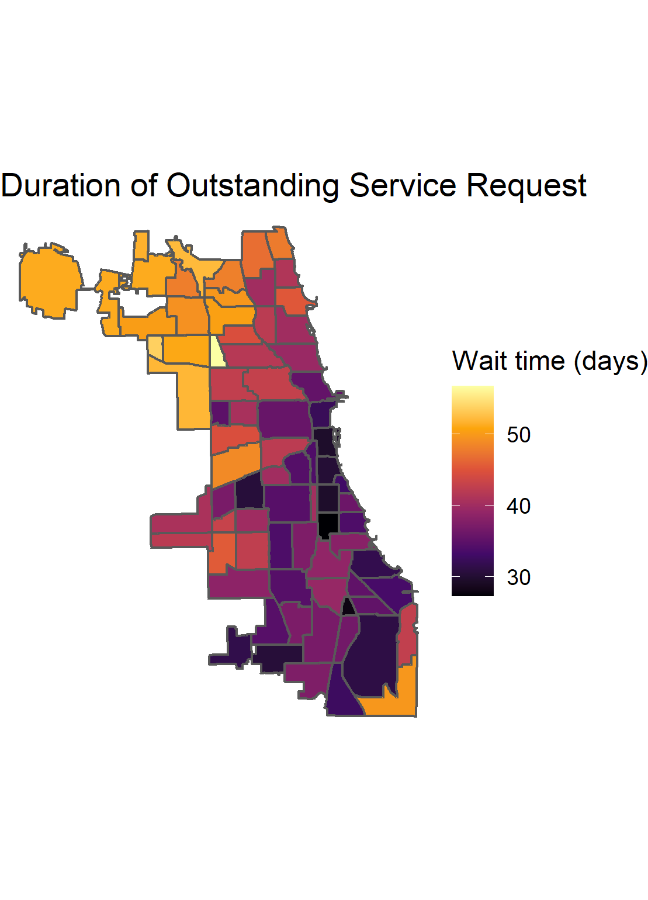
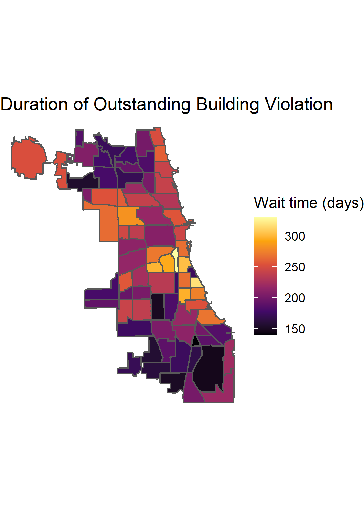

#Chicago Urban Neglect Explorer
Public wellbeing in cities relies on a combination of civic services and 
private stewardship. What parts of Chicago are being neglected by the public 
and private sectors? These maps display the amount of time it takes building 
owners to remedy building code violations, an indicator of private sector neglect,
and long 311 response times, an indicator of civic neglect. By plotting these 
side by side, we can study patterns in the geography of neglect.

## [Use the Chicago Urban Neglect Explore Here](https://jcinterrante.shinyapps.io/urban_neglect_shiny_app/)

## Example Maps

